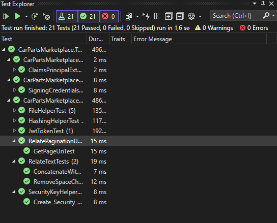

# 🚗 Car Parts Marketplace API

---

Bu proje kullanıcıların ürünlerini direk yada teklif yoluyla satabilmeleri için geliştirilmiş bir API servisidir.

---

## 📝API Dokümantasyonu

Projenin tüm endpointlerine ait detaylı bilgiye online dokümantasyondan ulaşmak için aşağıdaki butona tıklayınız.

---

.png)

## 🚀 Live Demo

Projeyi test etmek için aşağıdaki butona tıklayınız

---


## 🧪 Testler

<aside>
🧪 Unit testler sadece helper ve Jwt gibi spesifik metodlar için yazılmıştır.

</aside>

---



## 📌 Database Design

---


## 🔨 Kurulum

Projeyi bilgisayarınızda çalıştırmadan önce veritabanı,redis,mail servisleri için gerekli düzenlemeleri `appSettings.json` içerisinde gerçekleştirmemiz gerekmektedir.

---

- Projeyi bilgisayarınıza kurmak için ilk olarak repoyu klonlayınız.

```csharp
https://github.com/215-Protein-NET-Bootcamp/final-project-oguzcangenc.git
```

- Projeyi klonladıktan sonra `appSettings.json` içerisinde veritabanı bağlantısını yapınız.

```csharp
"ConnectionStrings": {
    "DefaultConnection": "Server=localhost;Port=5432;Database=CarPartsMarketplaceDb;User Id=postgres;Password=root;"
  },
```

- Burada gerekli düzenlemeleri yaptıktan sonra E-mail servisi için gerekli SMTP ayarlarını yapınız.

```csharp
"MailSettings": {
    "Mail": "mail@mail.com",
    "DisplayName": "Car Parts Marketplace",
    "Password": "123456789.*",
    "Host": "mail.mail.com",
    "Port": 465
  },
```

- Projede cache için Redis kullanılmaktadır. Redis bağlantı ayarlarını kendinize göre düzenleyiniz.

```csharp
"Redis": {
    "Host": "localhost",
    "Password": "",
    "Port": "6379",
    "InstanceName": "redis"
  }
```

Tüm ayarlarımızı tamamladıktan sonra veritabanı için `**Migration`** başlatabiliriz.

### 🔀 Migration İşlemleri

---

1. İlk olarak `Package Manager Console` ’u açalım. 
2. Burada `default project` olarak `[CarPartsMarketplace.Data](http://CarPartsMarketplace.Data)` katmanını seçelim. 
3. Seçimden sonra `Add-Migration mig_1` komutu ile migration dosyasını oluşturalım. 
4. Sonrasında `update-database` komutu ile veritabanını oluşturalım.

> Hangfire projeyi build ettikten sonra otomatik olarak kendine ait tabloları ve şemayı oluşturacaktır.
> 


---

## 💡 **Projede Kullanılan Teknolojiler**

Proje N katmanlı mimari bakış açısıyla kodlanmıştır. SOLID yazılım geliştirme prensiplerine uyularak geliştirilmiştir. Bu teknolojilere aşağıda ki listeden göz atabilirsiniz.

- **.NET 6.0 WebAPI**
- **Entity Framework Core 6.0**
- **PostgreSQL**
- **Hangfire**
- **Json Web Token (JWT)**
- **Redis**
- **Autofac**
- **Castle Core**
- **Serilog Console & File Logger**
- **Swagger API Docs**
- **Fluent Validation**
- **Auto Mapper**
- **MailKit**
- **xUnit**
- **Moq**
- **Fluent Assertation**
- **Docker**
- **CircleCI**
- **Heroku**

##
