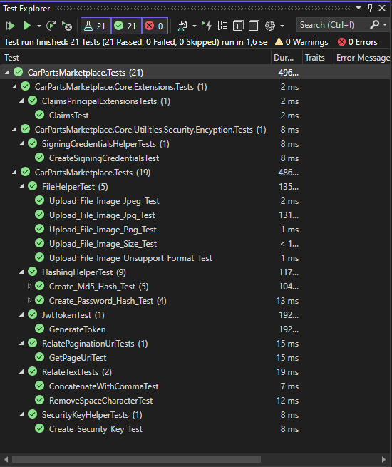

# Car Parts Marketplace API

---

Bu proje kullanýcýlarýn ürünlerini direk yada teklif yoluyla satabilmeleri için geliþtirilmiþ bir API servisidir.

---

## API Dokümantasyonu

Projenin tüm endpointlerine ait detaylý bilgiye online dokümantasyondan ulaþmak için aþaðýdaki butona týklayýnýz.

---

.png)

## Live Demo

Projeyi test etmek için aþaðýdaki butona týklayýnýz

---


## Database Design

---



## **Projede Kullanýlan Teknolojiler**

Proje N katmanlý mimari bakýþ açýsýyla kodlanmýþtýr. SOLID yazýlým geliþtirme prensiplerine uyularak geliþtirilmiþtir. Bu teknolojilere aþaðýda ki listeden göz atabilirsiniz.

- **.NET 6.0 WebAPI**
- **Entity Framework Core 6.0**
- **PostgreSQL**
- **Hangfire**
- **Json Web Token (JWT)**
- **Redis**
- **Autofac**
- **Castle Core**
- **Serilog Console & File Logger**
- **Swagger API Docs**
- **Fluent Validation**
- **Auto Mapper**
- **MailKit**
- **xUnit**
- **Moq**
- **Fluent Assertation**
- **Docker**
- **CircleCI**
- **Heroku**

## Kurulum

---

- Projeyi bilgisayarýnýza kurmak için ilk olarak repoyu klonlayýnýz.

```csharp
https://github.com/215-Protein-NET-Bootcamp/final-project-oguzcangenc.git
```

- Projeyi klonladýktan sonra `appSettings.json` içerisinde veritabaný baðlantýsýný yapýnýz.

```csharp
"ConnectionStrings": {
    "DefaultConnection": "Server=localhost;Port=5432;Database=CarPartsMarketplaceDb;User Id=postgres;Password=root;"
  },
```

- Burada gerekli düzenlemeleri yaptýktan sonra E-mail servisi için gerekli SMTP ayarlarýný yapýnýz.

```csharp
"MailSettings": {
    "Mail": "mail@mail.com",
    "DisplayName": "Car Parts Marketplace",
    "Password": "123456789.*",
    "Host": "mail.mail.com",
    "Port": 465
  },
```

- Projede cache için Redis kullanýlmaktadýr. Redis baðlantý ayarlarýný kendinize göre düzenleyiniz.

```csharp
"Redis": {
    "Host": "localhost",
    "Password": "",
    "Port": "6379",
    "InstanceName": "redis"
  }
```

##